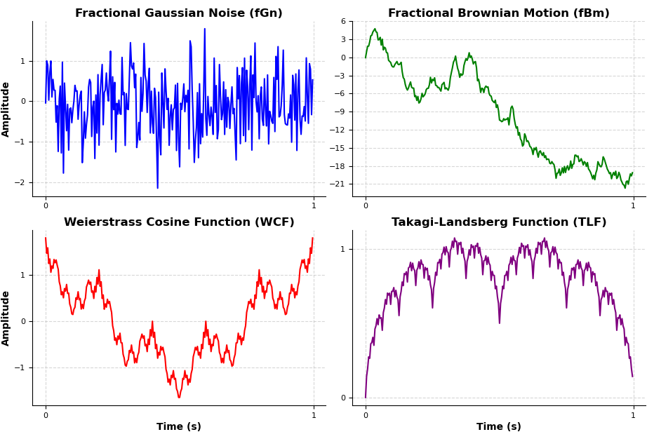
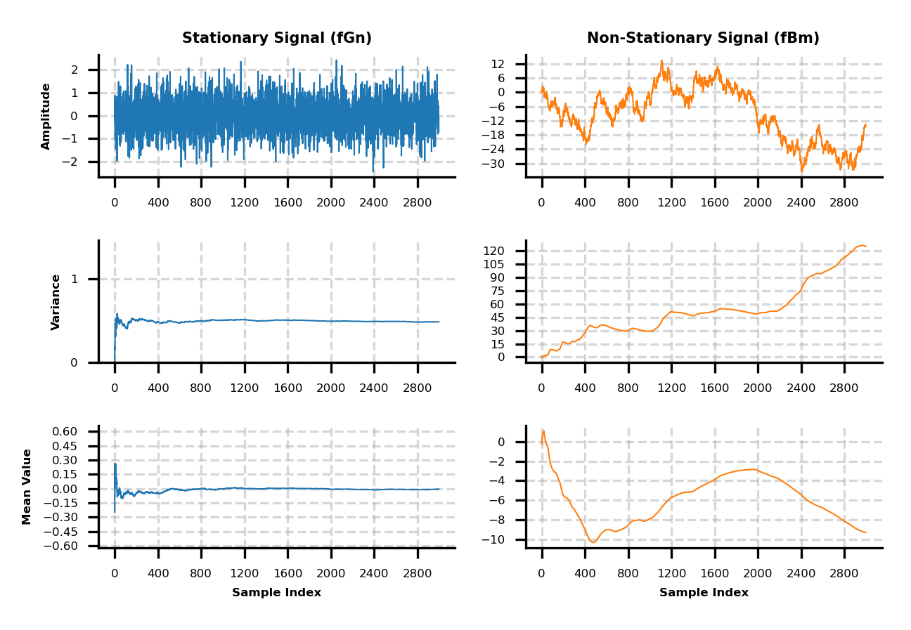

# Fractal Dimension and Clinical Neurophysiology: Code Repository

This repository contains the Python scripts and related resources used in the paper:

**"Fractal dimension and clinical neurophysiology fusion to gain a deeper brain signal understanding: a Systematic Review"**

The scripts generate the figures presented in the paper, providing insights into fractal dimension (FD) estimation methods, their applications, and step-by-step visualizations of key methodologies.

---

## Repository Structure

| File Name                     | Description                                                                                                                                                              |
|-------------------------------|--------------------------------------------------------------------------------------------------------------------------------------------------------------------------|
| `Koch_Curve.py`               | Generates the Koch Curve, demonstrating fractal properties visually.                                                                                                    |
| `Koch_Snowflakes.py`          | Generates Koch Snowflakes, another fractal structure highlighting self-similarity.                                                                                      |
| `Menger_Sponge.py`            | Creates the Menger Sponge, a 3D fractal model.                                                                                                                          |
| `Sierpinski_Triangle.py`      | Generates the Sierpinski Triangle, a classic 2D fractal example.                                                                                                        |
| `Stationary_vs_Non_Stationary.py` | Provides visualizations distinguishing stationary and non-stationary signals, relevant for fractal analysis.                                                            |
| `fGn_fBm_TLK_wsc.py`          | Simulates fractional Gaussian noise (fGn) and fractional Brownian motion (fBm), and computes their respective properties.                                                |
| `functions_Comparative.py`    | Contains functions for comparing various FD estimation methods, used in `main_Comparative.py`.                                                                          |
| `main_Comparative.py`         | Generates a figure comparing FD estimation methods for different signal types (STS, WCF, TLF, fBm, fGn) using methods like sPSD, DFA, HE, HFD, and KFD.                 |
| `functions_Higuchi.py`        | Implements helper functions for understanding Higuchi’s FD method, used in `main_Higuchi.py`.                                                                           |
| `main_Higuchi.py`             | Generates step-by-step visualizations of Higuchi’s FD method.                                                                                                          |
| `README.md`                   | Provides an overview of the repository, code instructions, and file descriptions.                                                                                      |

---

## Key Figures

### 1. **Comparison of FD Estimation Methods (Generated by `main_Comparative.py`)**

This figure compares various FD estimation methods across multiple signal types (STS).  
- **Dashed Black Line:** Represents the ideal scenario where estimated FD matches theoretical FD (\(FD_{th}\)).  
- **Gray Area:** Highlights the typical FD range (1 to 2) for time series.  
- **Extended Axis Limits:** Visualize methods exceeding this range.  

The results include methods like **sPSD, DFA, HE, HFD, and KFD** applied to **WCF, TLF, fBm, and fGn**.

### 2. **Understanding Higuchi’s Method (Generated by `main_Higuchi.py`)**

Figures illustrate the step-by-step process of **Higuchi’s FD method**, offering an intuitive understanding of its application and significance.

---
### Sample Output from `fGn_fBm_TLK_wsc.py`:


### Sample Output from `Stationary_vs_Non_Stationary.py`:


---
## How to Run the Code

1. **Clone the repository**:
   ```bash
   git clone https://github.com/BrainLabUnit/Fractal-dimension-and-clinical-neurophysiology.git
   cd Fractal-dimension-and-clinical-neurophysiology
